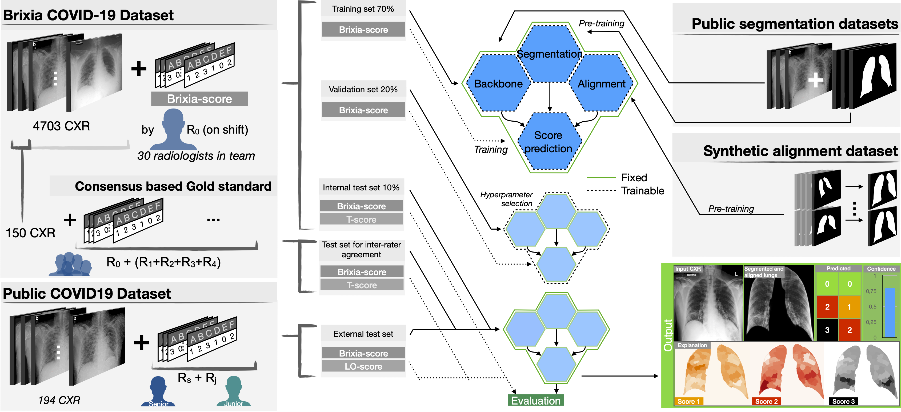

# Brixia-score-COVID-19
End-to-end learning for semiquantitative rating of COVID-19 severity on Chest X-rays. Additional material and updates.




## Introduction
In this work we designed an end-to-end deep learning architecture for predicting, on Chest X-rays images (CRX), a multi-regional score conveying the degree of lung compromise in COVID-19 patients.
Such semiquantitative scoring system, namely *Brixia-score*, was applied in serial monitoring of such patients, showing significant prognostic value, in one of the hospitals that experienced one of the highest pandemic peaks in Italy.

We exploited a clinical dataset of almost 5,000 CXR annotated images collected in the same hospital. Our BS-Net demonstrated self-attentive behavior and a high degree of accuracy in all processing stages. 

Through inter-rater agreement tests and a gold standard comparison, we were able to show that our solution outperforms single human annotators in rating accuracy and consistency, thus supporting the possibility of using this tool in contexts of computer-assisted monitoring.

This project is approved by the University of Brescia's Ethics Committee 0032690/20 (11/05/2020)

## Data
### Annotation and CXR from Cohen's dataset

We exploit the public repository by [Cohen et al.](https://github.com/ieee8023/covid-chestxray-dataset) which contains CXR images (We downloaded a copy on May 11th, 2020).

In order to contribute to such public dataset, two expert radiologists, a board-certified staff member and a trainee with 22 and 2 years of experience respectively, produced the related Brixia-score annotations for CXR in this collection, exploiting [labelbox](https://labelbox.com), an online solution for labelling. After discarding problematic cases (e.g., images with a significant portion missing, too small resolution, the impossibility of scoring for external reasons, etc.), the final dataset is composed of 192 CXR, completely annotated according to the Brixia-score system.


*Below a list of each field in the [annotation csv](public-annotations.csv), with explanations where relevant*

| Attribute | Description |
|------|-----|
| filename | filename from Cohen dataset |
| from S-A to S-F | The 6 regions annotatated by a Senior radiologist (+20yr expertise)
| S-Global | Global score by the Senior radiologist (sum of S-A : S-F)
| from J-A to J-F | The 6 regions annotatated by a Junior radiologist (+2yr expertise)
| J-Global | Global score by the Junior radiologist (sum of S-A : S-F)

### Brixia-dataset
*Waiting for Ethical Cometee approval.*

### Segmentation Dataset
*TBD*


## Disclaimer

This software, the data, and the annotations, are provided "as-is" without any guarantee of correct functionality or guarantee of quality. No formal support for this software will be given to users. It is possible to report issues on GitHub though. This repository and any other part of the BrixIA project should not be used for medical purposes. In particular this software should not be used to make, support, gain evidence on and aid medical decisions, interventions or diagnoses. 

Please do not claim diagnostic performance of a model without a clinical study! This is not a kaggle competition dataset. 


## License and Attribution

- Code and annotations:
- Data: 
- Each image has license specified in the metadata.csv file. Including Apache 2.0, CC BY-NC-SA 4.0, CC BY 4.0.

The metadata.csv, scripts, and other documents are released under a CC BY-NC-SA 4.0 license. Companies are free to perform research. Beyond that contact us.

## Contact Information

## Citation

Paper avaible [here](https://arxiv.org/abs/2006.04603)
```
@article{sig2020covid,
  title={End-to-end learning for semiquantitative rating of COVID-19 severity on Chest X-rays},
  author={Alberto Signoroni and Mattia Savardi and Sergio Benini and Nicola Adami and Riccardo Leonardi and Paolo Gibellini and Filippo Vaccher and Marco Ravanelli and Andrea Borghesi and Roberto Maroldi and Davide Farina},
  journal={arXiv 2006.04603},
  url={https://arxiv.org/abs/2006.04603},
  year={2020}
}
```