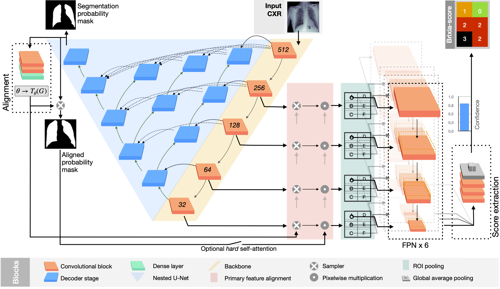
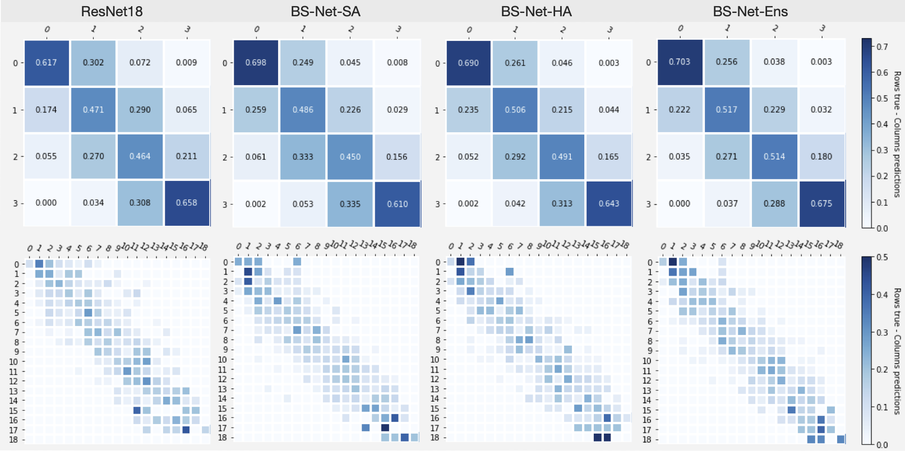

# Brixia-score-COVID-19
End-to-end learning for semiquantitative rating of COVID-19 severity on Chest X-rays. Additional material and updates.


Table of Contents
=================

  * [Introduction](#Introduction)
  * [Brixia-score description](#Brixia-score)
  * [Data](#Data)
  * [Proposed architecture](#BSNet)
  * [Getting Started](#getting-started)
  * [Results](#Results)
  * [License](#license-and-attribution)
  * [Citation](#Citation)


## Introduction
In this work we designed an end-to-end deep learning architecture for predicting, on Chest X-rays images (CRX), a multi-regional score conveying the degree of lung compromise in COVID-19 patients.
Such semiquantitative scoring system, namely *Brixia-score*, was applied in serial monitoring of such patients, showing significant prognostic value, in one of the hospitals that experienced one of the highest pandemic peaks in Italy.

We exploited a clinical dataset of almost 5,000 CXR annotated images collected in the same hospital. Our BS-Net demonstrated self-attentive behavior and a high degree of accuracy in all processing stages. 

Through inter-rater agreement tests and a gold standard comparison, we were able to show that our solution outperforms single human annotators in rating accuracy and consistency, thus supporting the possibility of using this tool in contexts of computer-assisted monitoring.

This project is approved by the University of Brescia's Ethics Committee 0032690/20 (11/05/2020)

## Brixia-score

The multi-region 6-valued **Brixia-score** was designed and implemented in routine reporting by the Radiology Unit 2 of ASST Spedali Civili di Brescia, and later validated for risk stratification on a large population.
According to it, lungs in anteroposterior (AP) or posteroanterior (PA) views, are subdivided into six zones, three for each lung, as shown in Figure above:
- Upper zones (A and D): above the inferior wall of the aortic arch;
- Middle zones (B and E): below the inferior wall of the aortic arch and above the inferior wall of the right inferior pulmonary vein (i.e., the hilar structures);
-  Lower zones (C and F): below the inferior wall of the right inferior pulmonary vein (i.e., the lung bases). 

Whenever it is difficult to identify some anatomical landmarks, due to technical reasons (for example bedside CXR in critical patients), it is acceptable to divide each lung into three equal zones.
For each zone, a score (ranging from 0 to 3) is assigned, based on the detected lung abnormalities:

- 0: no lung abnormalities;
- 1: interstitial infiltrates;
- 2: interstitial (dominant), and alveolar infiltrates;
- 3: interstitial, and alveolar (dominant) infiltrates.


The six scores may be then aggregated to obtain a Global Score in the range *[0,18]*.
During the peak period, the *Brixia-score* has been systematically used to report CXR in COVID-19 patients.

## Data
### Annotation and CXR from Cohen's dataset

We exploit the public repository by [Cohen et al.](https://github.com/ieee8023/covid-chestxray-dataset) which contains CXR images (We downloaded a copy on May 11th, 2020).

In order to contribute to such public dataset, two expert radiologists, a board-certified staff member and a trainee with 22 and 2 years of experience respectively, produced the related Brixia-score annotations for CXR in this collection, exploiting [labelbox](https://labelbox.com), an online solution for labelling. After discarding problematic cases (e.g., images with a significant portion missing, too small resolution, the impossibility of scoring for external reasons, etc.), the final dataset is composed of 192 CXR, completely annotated according to the Brixia-score system.


*Below a list of each field in the [annotation csv](public-annotations.csv), with explanations where relevant*
<details>
 <summary>Scheme</summary>

| Attribute | Description |
|------|-----|
| filename | filename from Cohen dataset |
| from S-A to S-F | The 6 regions annotatated by a Senior radiologist (+20yr expertise), from 0 to 3 
| S-Global | Global score by the Senior radiologist (sum of S-A : S-F),  from 0 to 18
| from J-A to J-F | The 6 regions annotatated by a Junior radiologist (+2yr expertise),  from 0 to 3 
| J-Global | Global score by the Junior radiologist (sum of S-A : S-F),  from 0 to 18
</details>


### Segmentation Dataset
We provide the script to prepare the dataset as described in the article. The data can be downloaded from their respective sites.

<details>
 <summary>Table</summary>

|  | Training-set |  Test-set | Split | 
|------|-----|-----|-----|
|[Montgomery County](https://ceb.nlm.nih.gov/repositories/tuberculosis-chest-x-ray-image-data-sets/) | 88           | 50       | first 50 |      
| [Shenzhen Hospital](https://arxiv.org/abs/1803.01199) | 516          | 50       | first 50 |
| [JSRT database](http://db.jsrt.or.jp/eng.php)     | 124          | 123      | original |
|------|-----|-----|-----|
|Total             | 728           |223      ||
</details>

We exploit different segmentation datasets in order to pre-train the ested-Unet module of the proposed architecture. We used the original training/test set splitting when present (as the case of the JSRT database), otherwise we took the first 50 images as test set, and the remaining as training set (see Table above).

*Script TBD*

### Alignment synthetic dataset
To avoid the inclusion of anatomical parts not belonging to the lungs in the AI pipeline, which would increase the task complexity or introduce unwanted biases, we integrated into the pipeline an alignment block. This exploits a synthetic dataset (used for on-line augmentation) composed of artificially transformed images from the segmentation dataset (see Table below), including random rotations, shifts, and zooms, which is used in the pre-training phase.

The parameters refer to the implementation in Albumentation. In the last column is expressed the probability of the specific transformation being applied.

<details>
 <summary>Additional details</summary>

|    | Parameters (up to) | Probability |
|----|-----|-----|
|Rotation | 25 degree  |    0.8  |
|Scale    | 10%          | 0.8   |
|Shift     | 10%           | 0.8 |
|Elastic transformation  | alpha=60, sigma=12  |   0.2   |
|Grid distortion     | steps=5, limit=0.3 |    0.2  |
|Optical distortion     | distort=0.2, shift=0.05    |     0.2   |
</details>

*Script TBD*


### Brixia-dataset
*Waiting for Ethical Cometee approval.*


## BSNet
Detailed scheme of the proposed architecture. In particular, in the top-middle the CXR to be analyzed is fed to the network. The produced outputs are: the segmentation mask of the lungs (top-left); the aligned mask (middle-left); the *Brixia-score* (top-right).



## Getting Started
### Install Dependencies

The provided code is written for Python 3.x. To install the needed requirements run:
```
pip install -r requirements.txt
```
For the sake of performance, we suggest to install `tensorflow-gpu` in place of the standard CPU version.

Include the `src` folder in your python library path or launch python from that folder.

### Load Cohen dataset with BrixiaScore annotations
```python
from datasets import brixiascore_cohen  as bsc

# Check the docsting for additional info
X_train, X_test, y_train, y_test = bsc.get_data()
```

## Results
Consistency/confusion matrices based on lung regions score values (top, 0-3), and on Global Score values (bottom, 0-18).


Results of the proposed system on five examples from the test-set. (top) Three good predictions. (bottom) Two cases chosen between the worst prediction regarding the original clinical annotation *H*. For each block, the most left image is the input CXR that the network analyses, followed by the aligned and masked lungs, to analyse the quality of the segmentation and alignment block. While in the second row we show the Predicted *Brixia-score* with the clinical ground truth *H*, and the explainability maps. In those maps the relevance goes from white colour (i.e., no contribution to that prediction) to the class colour (i.e., the region had an important weight for the class decision).


## License and Attribution

**Disclaimer**

This software, the data, and the annotations, are provided "as-is" without any guarantee of correct functionality or guarantee of quality. No formal support for this software will be given to users. It is possible to report issues on GitHub though. This repository and any other part of the BrixIA project should not be used for medical purposes. In particular this software should not be used to make, support, gain evidence on and aid medical decisions, interventions or diagnoses. 

Please do not claim diagnostic performance of a model without a clinical study! This is not a kaggle competition dataset. 


###  Data
   - Pulic Cohen dataset: Each image has license specified in the original file by [Cohen's repository](https://github.com/ieee8023/covid-chestxray-dataset) file. Including Apache 2.0, CC BY-NC-SA 4.0, CC BY 4.0. There are additional 7 images from Brescia under a CC BY-NC-SA 4.0 license.
   - Brixia-score annotations for the pulic Cohen's dataset are released under a CC BY-NC-SA 4.0 license.
  
### Code
  - Will be released under MIT license


## Contact Information
*TBD*

## Citation

Preprint avaible [here](https://arxiv.org/abs/2006.04603)
```
@article{sig2020covid,
  title={End-to-end learning for semiquantitative rating of COVID-19 severity on Chest X-rays},
  author={Alberto Signoroni and Mattia Savardi and Sergio Benini and Nicola Adami and Riccardo Leonardi and Paolo Gibellini and Filippo Vaccher and Marco Ravanelli and Andrea Borghesi and Roberto Maroldi and Davide Farina},
  journal={arXiv 2006.04603},
  url={https://arxiv.org/abs/2006.04603},
  year={2020}
}
```
